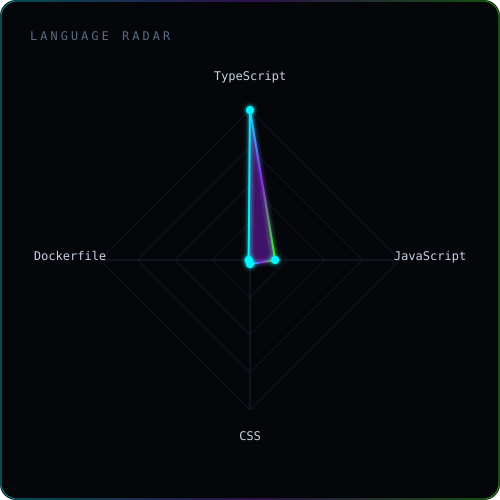
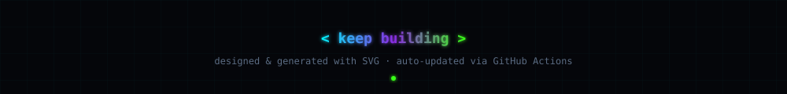

<!--
  ┌─────────────────────────────────────────────────────────────┐
  │  This README is a dashboard. Almost every visual below is a   │
  │  handcrafted, SMIL-animated SVG generated by /scripts and     │
  │  auto-refreshed by GitHub Actions. Edit the generators, not   │
  │  this file, to change the visuals.                            │
  │                                                               │
  │  Replace every `nbashno` with your username if you fork.     │
  └─────────────────────────────────────────────────────────────┘
-->

<!-- ░░ SECTION 1+2+3 · BOOT SCREEN / TYPING TITLES ░░ -->

<!-- ░░ divider ░░ -->

<!-- ░░ SECTION 3 · ANIMATED TERMINAL ░░ -->

 

<!-- ░░ SECTION 4 · LIVE GITHUB DASHBOARD ░░ -->

<!-- ░░ divider ░░ -->

<!-- ░░ SECTION 5 · CUSTOM METRICS ░░ -->

<!-- Generated by .github/workflows/metrics.yml (needs METRICS_TOKEN secret) -->

<!-- ░░ SECTION 6 · NEON CONTRIBUTION SNAKE ░░ -->

<!-- Generated into the `output` branch by .github/workflows/snake.yml -->
<picture>
  <source media="(prefers-color-scheme: dark)"  srcset="https://raw.githubusercontent.com/nbashno/nbashno/output/snake.svg"/>
  <source media="(prefers-color-scheme: light)" srcset="https://raw.githubusercontent.com/nbashno/nbashno/output/snake.svg"/>
  
</picture>

<!-- ░░ SECTION 7+8 · 3D CALENDAR / ACTIVITY GRAPH ░░ -->

<!-- ░░ divider ░░ -->

<!-- ░░ SECTION 10 · LANGUAGE RADAR ░░ -->

<!-- ░░ SECTION 11 · TECH STACK (hexagon grid) ░░ -->

### ` TECH STACK `

 

<!-- ░░ SECTION 12 · SYSTEM ARCHITECTURE ░░ -->

<!-- ░░ divider ░░ -->

<!-- ░░ SECTION 13 · TOP PROJECTS ░░ -->

### ` TOP PROJECTS `

<!-- ░░ SECTION 15 · CODING TIME (Wakatime) ░░ -->

### ` CODING TIME `

<!-- Requires WAKATIME_API_KEY secret + the waka-readme-stats action, or paste
     your public Wakatime embed URL below. -->

<!-- ░░ divider ░░ -->

<!-- ░░ SECTION 16 · VISITOR COUNTER ░░ -->

<!-- ░░ SECTION 18 · FOOTER ░░ -->

